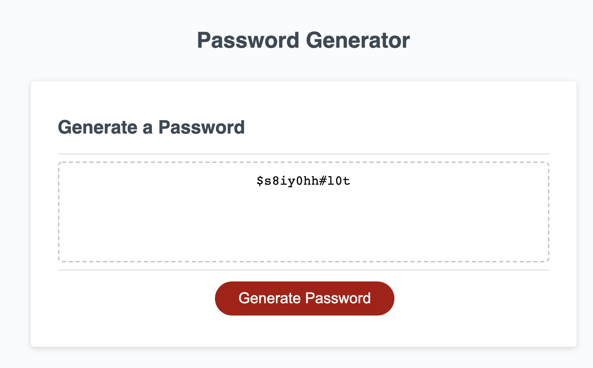
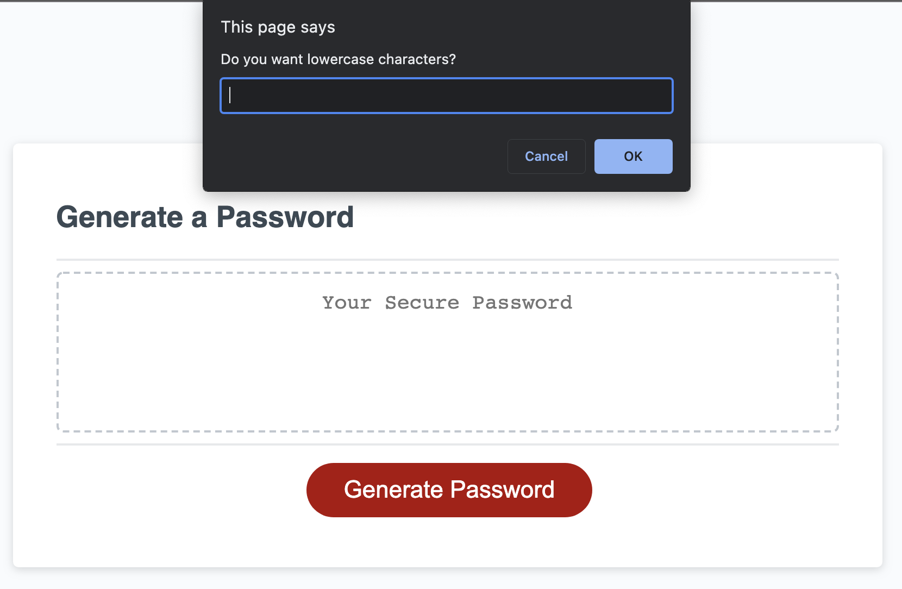
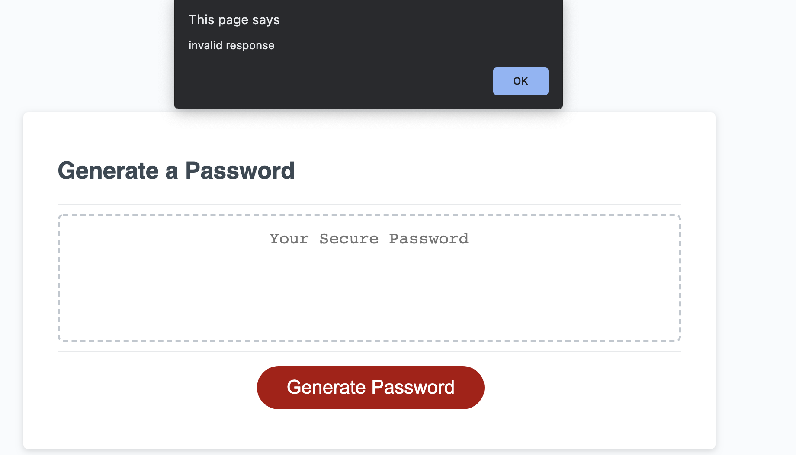
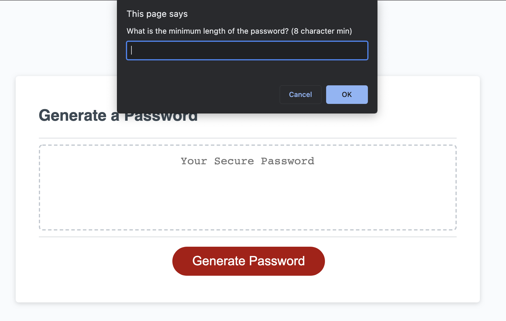

# Password_Generator

Creates a string of characters following the conditions the User asks for to create a truely random password

## Description

- User clicks the Generate button and is prompted with which types of characters to include in the password, including:
  1. Lowercase Letters
  2. Uppercase Letters
  3. Numbers
  4. Special Characters
- User is also prompted for the minimum and maximum desired length of the password, and a string of a random
  length between these parameters determines the length
- A random password is created by matching the criteria the user wants to characters used in the password, which
  is then displayed in the textfield area on the HTML page

## Screenshots

## Links

-Link to [GitHub Repo](https://github.com/Zacharycampanelli/Password_Generator)

-Link to [Deployed Webpage](https://zacharycampanelli.github.io/Password_Generator/)

## Authors

Zachary Campanelli

[@zackcampanelli](https://www.linkedin.com/in/zackcampanelli/)
